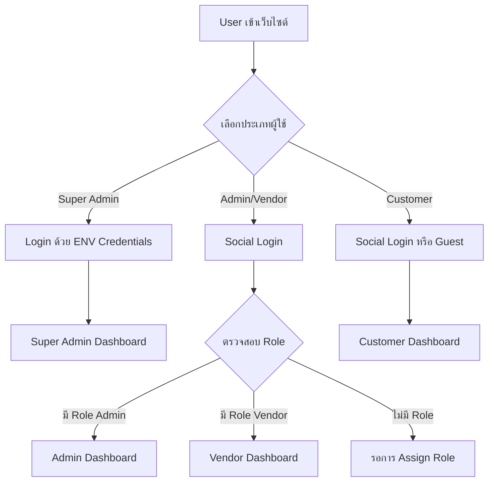

# ระบบ Role-based Authentication - SSS Surplus Marketplace

## 🎯 แนวคิดหลัก: Social Login + Role Assignment

### 🔑 Authentication Strategy

#### **Super Admin เท่านั้น** → Environment Variables
```env
SUPER_ADMIN_MODE=true
SUPER_ADMIN_EMAILS=sanchai5651@gmail.com
SUPER_ADMIN_PASSWORD="Safety17"
```

#### **Admin & Vendor** → Social Login + Role Assignment
- Login ผ่าน Google, Facebook, Line
- หลัง Social Login → ตรวจสอบ Role ในระบบ
- ถ้าไม่มี Role → รอ Super Admin assign

## 🏗️ Authentication Flow Architecture

### 1. **User Login Process**



### 2. **Role Assignment Hierarchy**

```
🔥 Super Admin (ENV Login)
├── 👨‍💼 Admin (Social Login + Assigned Role)
│   ├── 🏪 Vendor (Social Login + Assigned Role)
│   └── 📦 Product Manager
└── 🛠️ System Settings
```

### 3. **Permission Matrix**

| ฟีเจอร์ | Super Admin | Admin | Vendor | Customer |
|---------|-------------|-------|--------|----------|
| จัดการ Admin | ✅ | ❌ | ❌ | ❌ |
| Assign Vendor Role | ✅ | ✅ | ❌ | ❌ |
| อนุมัติสินค้า | ✅ | ✅ | ❌ | ❌ |
| เพิ่มสินค้า | ✅ | ✅ | ✅ | ❌ |
| ซื้อสินค้า | ✅ | ✅ | ✅ | ✅ |

## 🎨 User Experience Benefits

### ✅ **ข้อดีของระบบนี้:**

#### 🚀 **User-Friendly:**
- ไม่ต้องจำ email/password หลายชุด
- ใช้ Social accounts ที่มีอยู่แล้ว
- Login ง่ายและรวดเร็ว

#### 🔒 **Security:**
- Super Admin แยกต่างหาก (secure)
- OAuth security จาก Social providers
- ลด password-related vulnerabilities

#### 🎯 **Management:**
- Centralized role management
- Clear permission hierarchy
- Easy onboarding process

#### 💼 **Business Benefits:**
- ลดต้นทุนการจัดการ user accounts
- เพิ่มอัตราการลงทะเบียน
- ลดการติดต่อ support เรื่อง password

## 🔄 Role Assignment Workflow

### 1. **Admin Assignment (โดย Super Admin)**

```
1. User login ด้วย Social → ข้อมูลเข้าระบบ
2. Super Admin เห็น "Pending Users" 
3. Super Admin assign role "Admin"
4. User ได้รับ notification
5. User login อีกครั้ง → เข้า Admin Dashboard
```

### 2. **Vendor Assignment (โดย Admin หรือ Super Admin)**

```
1. User login ด้วย Social → ข้อมูลเข้าระบบ
2. Admin เห็น "Pending Vendors"
3. Admin ตรวจสอบเอกสาร/ข้อมูล
4. Admin assign role "Vendor"
5. Vendor ได้รับ notification
6. Vendor login อีกครั้ง → เข้า Vendor Portal
```

## 📱 UI/UX Design Concepts

### 1. **Login Page Improvements**

#### **Current State:**
- มี dropdown เลือก Customer/Vendor/Admin/Super Admin
- Customer มี Social login
- Admin/Vendor ไม่มี Social login

#### **Proposed State:**
- **Super Admin**: ยังคงใช้ email/password
- **Admin/Vendor**: เพิ่ม Social login buttons
- **Customer**: ยังคงเหมือนเดิม

### 2. **Role Assignment Dashboard**

#### **Super Admin Dashboard:**
```
📊 Dashboard Overview
├── 👥 Pending Users (รอ assign role)
├── 👨‍💼 Admin Management
├── 🏪 Vendor Management
└── ⚙️ System Settings
```

#### **Admin Dashboard:**
```
📊 Dashboard Overview
├── 🏪 Pending Vendors (รอ assign role)
├── 📦 Product Management
├── 💰 Order Management
└── 📊 Reports
```

### 3. **Notification System**

#### **For Users waiting for role assignment:**
```
🔔 "Your account is pending approval. 
   You will receive a notification once your role is assigned."
```

#### **For Admins:**
```
🔔 "3 new users are waiting for role assignment"
🔔 "5 vendors are pending approval"
```

## 🛠️ Technical Implementation

### 1. **Database Schema**

```sql
-- Users table (จาก Social Login)
CREATE TABLE users (
  id UUID PRIMARY KEY,
  email VARCHAR(255) UNIQUE,
  name VARCHAR(255),
  avatar_url TEXT,
  provider VARCHAR(50), -- 'google', 'facebook', 'line'
  provider_id VARCHAR(255),
  role ENUM('pending', 'customer', 'vendor', 'admin', 'super_admin'),
  is_active BOOLEAN DEFAULT true,
  assigned_by UUID REFERENCES users(id),
  assigned_at TIMESTAMP,
  created_at TIMESTAMP DEFAULT NOW()
);

-- Role permissions
CREATE TABLE role_permissions (
  id UUID PRIMARY KEY,
  role VARCHAR(50),
  permission VARCHAR(100),
  created_at TIMESTAMP DEFAULT NOW()
);
```

### 2. **API Endpoints**

```javascript
// Authentication
POST /api/auth/social-login
POST /api/auth/super-admin-login

// Role Management
GET /api/admin/pending-users
POST /api/admin/assign-role
GET /api/admin/users
PUT /api/admin/users/:id/role

// User Profile
GET /api/user/profile
PUT /api/user/profile
```

### 3. **Middleware for Role Checking**

```javascript
// middleware/auth.js
export function requireRole(allowedRoles) {
  return async (req, res, next) => {
    const user = await getCurrentUser(req);
    
    if (!user || !allowedRoles.includes(user.role)) {
      return res.status(403).json({ 
        error: 'Insufficient permissions' 
      });
    }
    
    req.user = user;
    next();
  };
}

// Usage
app.get('/api/admin/*', requireRole(['admin', 'super_admin']));
app.get('/api/vendor/*', requireRole(['vendor', 'admin', 'super_admin']));
```

## 🚀 Implementation Phases

### Phase 1: Core Authentication
- ✅ Super Admin login (ENV-based)
- 🔄 Social login for Admin/Vendor
- 🔄 Role checking middleware

### Phase 2: Role Assignment UI
- 🔄 Super Admin dashboard
- 🔄 Pending users management
- 🔄 Role assignment interface

### Phase 3: Enhanced UX
- 🔄 Notification system
- 🔄 Email notifications
- 🔄 Mobile-responsive design

### Phase 4: Advanced Features
- 🔄 Bulk role assignment
- 🔄 Role history tracking
- 🔄 Advanced permissions

## ⚠️ Security Considerations

### 1. **Super Admin Protection**
- Environment variables only
- IP whitelist (optional)
- 2FA recommendation

### 2. **Social Login Security**
- Verify OAuth tokens
- Store minimal user data
- Regular token refresh

### 3. **Role Assignment Security**
- Audit logs for role changes
- Require confirmation for sensitive roles
- Time-limited role assignments

---

*ระบบนี้จะทำให้การจัดการผู้ใช้ง่ายขึ้น และเพิ่ม user experience อย่างมาก*

